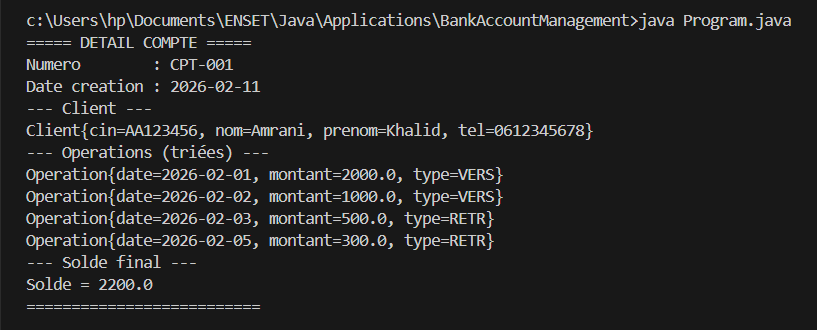

# Application 2 : Gestion des comptes bancaires

On souhaite modéliser un système simple de gestion de comptes bancaires. Un compte bancaire appartient à un seul client et contient un ensemble d’opérations (versements ou retraits).

Pour mieux comprendre la logique de conception orientée objet utilisée dans cet exercice, il est possible de consulter la démonstration suivante :

Démonstration (YouTube) : https://www.youtube.com/watch?v=RkgD_bj_kJE

---

## Les classes à modéliser sont les suivantes :

- **Client** : cin, nom, prenom, telephone  
- **Operation** : date, montant, type (“VERS” ou “RETR”)  
- **Compte** : numero, dateCreation, solde, client, operations  

La classe `Compte` doit contenir une méthode supplémentaire :

- `double getSolde()` : retourne le solde actuel du compte.

---

## Travail demandé

1. Implémenter la classe `Client`.

2. Implémenter la classe `Operation`.

3. Implémenter la classe `Compte` en respectant les contraintes suivantes :
   - Une liste d’opérations doit être maintenue dans chaque compte.
   - La méthode `getSolde()` doit recalculer le solde à partir de l’ensemble des opérations :
     - “VERS” augmente le solde.
     - “RETR” diminue le solde.

4. Créer une classe `Program` exécutable contenant le scénario suivant :
   - Créer un client.
   - Créer un compte bancaire associé à ce client.
   - Ajouter plusieurs opérations (versements et retraits).
   - Afficher le détail complet du compte :
     - numéro du compte,
     - informations du client,
     - liste des opérations,
     - solde final du compte.
   - Trier les opérations par date croissante avant l’affichage.

**Result** :

