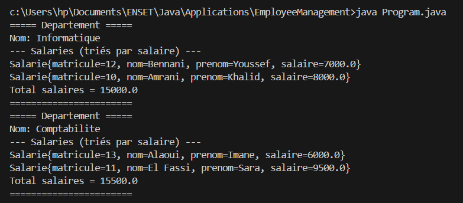

### Application 1 : gestion des salariés Se référer au chapitre **5.3** (page **58**) du cours Java dans POO_JAVA.pdf.
#### Énoncé
On souhaite modéliser une relation **ManyToOne** entre les classes **Salarie** et **Departement**.

Un département peut regrouper plusieurs salariés.

Les deux classes Departement et Salarie sont définies de la manière suivante :

- **Departement** : id, nom
- **Salarie** : matricule, nom, prenom, salaire

#### Travail demandé
1. Reprendre la classe salarié du cours
2. implémenter la classe Departement
3. Créer une classe Program exécutable qui teste l’ensemble des éléments de la manière suivante :
- Créer deux départements et plusieurs salariés, puis affecter chaque salarié à un département.
- **Afficher le détail d’un département** : nom du département, liste des salariés et **total des salaires**.
- **Trier la liste des salariés d’un département par salaire croissant** avant l’affichage.

**Result** :

