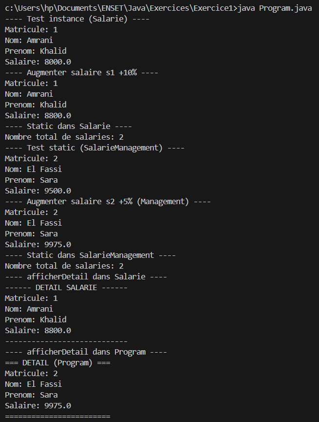

# Exercice 1 : Réaliser l’exercice n°3 des pages 23–24 dans POO_JAVA.pdf.
### Exercice 3 : Gestion des Salariés

Cet exercice vise à manipuler les membres d’instance, les membres `static`, ainsi que l’organisation en plusieurs classes.

---

## 1. Classe `Salarie`

Créer une classe `Salarie` contenant les attributs suivants :

* `matricule` (int)
* `nom` (String)
* `prenom` (String)
* `salaire` (double)
* `static int nombreSalaries` qui compte le nombre total d’objets créés

   Voici le [classe Salarie](./salarieManagement/Salarie.java)

### Travail demandé :

1. Créer une méthode membre `afficherInfos()` qui affiche les informations du salarié.

   Reponse ligne 22 dans [Salarie](./salarieManagement/Salarie.java#L22)

2. Créer une méthode membre `augmenterSalaire(double taux)` qui augmente le salaire selon un pourcentage.

   Reponse ligne 30 dans [Salarie](./salarieManagement/Salarie.java#L30)

3. Créer une méthode `static printNombreSalaries()` qui affiche le nombre total de salariés.

   Reponse ligne 35 dans [Salarie](./salarieManagement/Salarie.java#L35)
4. Répondre :

   * Peut-on appeler `afficherInfos()` sans créer un objet ? Pourquoi ?

      Non, parce que afficherInfos() n’est pas static. Il faut un objet (ex: s1) pour l’appeler : s1.afficherInfos().
   * Pourquoi `printNombreSalaries()` est-elle une méthode `static` ?

      Parce que ça concerne la classe entière (le compteur total), pas un salarié précis. On l’appelle comme ça : Salarie.printNombreSalaries().
5. Ajouter une méthode `static afficherDetail(Salarie s)` qui affiche le détail d’un salarié passé en paramètre.

   Reponse ligne 37 dans [Salarie](./salarieManagement/Salarie.java#L37)

---

## 2. Classe `SalarieManagement`

1. Reproduire les mêmes fonctionnalités de la classe `Salarie`, mais uniquement avec des méthodes `static` :

   * Méthode `static afficherInfos(Salarie s)`
   * Méthode `static augmenterSalaire(Salarie s, double taux)`
   * Méthode `static printNombreSalaries()`
   
   voici le [classe SalarieManagement](./salarieManagement/SalarieManagement.java)
2. Pourquoi les méthodes précédentes doivent-elles recevoir une référence de type `Salarie` ?

   Parce que les méthodes sont static, donc elles n’ont pas accès à un salarié précis.
   Du coup on leur passe le salarié sur lequel on veut travailler.

---

## 3. Classe `Program`

Créer une classe `Program` permettant de :

* Instancier plusieurs objets `Salarie`
* Tester les méthodes d’instance de `Salarie`
* Tester les méthodes `static` de `SalarieManagement`
* Créer une méthode `static afficherDetail(Salarie s)` pour afficher le détail d’un salarié

   voici le [classe Program](./salarieManagement/Program.java)

---

**Objectif :**
Savoir distinguer les comportements dépendant d’un objet (méthodes membres) et ceux qui concernent l’ensemble de la classe (méthodes `static`).

**Result** :

