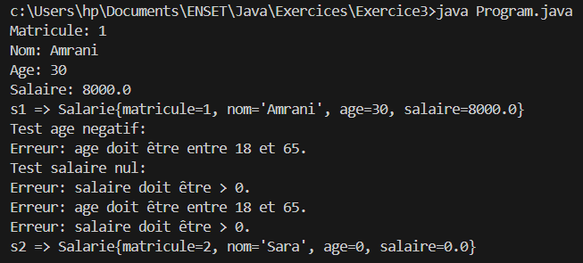

# Exercice 3 : Réaliser l’exercice n°3 des pages 42–43 dans POO_JAVA.pdf.
### Exercice 3 — Créer une classe Salarié (avec getters/setters)

1. Écrire le code source d’une classe `Salarie` définie par les éléments suivants :
- `matricule`, `nom`, `age`, `salaire` : tous les attributs doivent être `private`
- Fournir les getters et setters pour chaque attribut afin de contrôler leur accès et modification
- Ajouter une règle de gestion pour que le salaire soit supérieur à 0
- Est-ce que le constructeur respecte cette règle ? Penser à réutiliser le code
- Ajouter une règle pour que l’âge soit compris entre 18 et 65 ans
- Ajouter un constructeur qui permet d’initialiser tous les champs d’un salarié  
  Penser à la réutilisation de code afin de prendre en compte ces deux règles
- Ajouter (redéfinir) la méthode `toString()` qui retourne le détail d’un salarié

2. Créer une classe exécutable `Program` qui permet de :
- Créer un premier salarié `s1` via le constructeur
- Modifier ses attributs via les setters
- Afficher ses informations via les getters
- Afficher ses informations via la méthode `toString()`
- Tester les validations : tenter d’af
fecter un âge négatif ou un salaire nul
- Créer un deuxième salarié `s2` en utilisant le constructeur avec paramètres et afficher ses informations  
  Essayer de vérifier s’il accepte un salaire ou un âge qui contredit les règles de gestion.

3. Question :  
Expliquez comment les getters et setters garantissent la cohérence et la sécurité des données du salarié.

**Result** :

