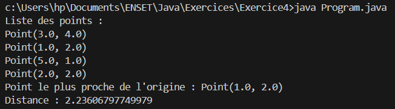

# Exercice 4 : Réaliser l’exercice n°2 de la page 51 dans POO_JAVA.pdf.
### Exercice 2 — Gestion de points et calcul du plus proche point à l’origine

1. Créer une classe `Point` avec encapsulation, getters et setters.  
   Les coordonnées ne peuvent pas être négatives, même après déplacement.  
   Créer ensuite une classe `Program`.

2. Créer une `ArrayList<Point>` et ajouter plusieurs points.

3. Afficher tous les points.

4. Écrire une méthode pour trouver le point le plus proche de l’origine `(0, 0)` parmi la liste.

